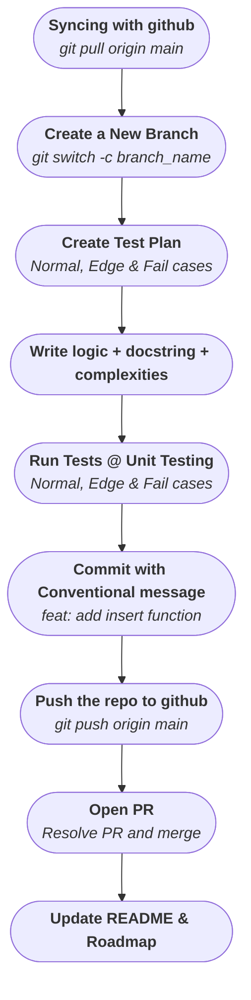

# DSA Tracker

**Industry-grade DSA Learning Tracker in Python** - not just solutions but **real engineering practices**: Clean architecture, unit testing, complexity analysis and much more with Daily professional commits.

This repo is my personal journey to be an **Industrial-graded Developer**

---

## Table of Contents

- [About the DSA Tracker](#about-the-dsa-tracker)
- [Features](#features)
- [Roadmap](#roadmap)
- [Critical for Mastering DSA](#critical-for-mastering-dsa)
- [Getting Started](#getting-started)
  - [Prerequisites](#prerequisites)
  - [SetUP and Installations](#setup-and-installations)
  - [Stress Test the Environment](#stress-test-the-environment)
- [Project Structure](#project-structure)
- [Contributing \& Daily Workflow (Personal+Industry-graded)](#contributing--daily-workflow-personalindustry-graded)
- [LICENSE](#license)

---

## About the DSA Tracker

This repo tracks my learning journey of DSA while practicing **Industry-graded** best practices

Writing Code or just cracking the logic is not the motive for this repo.

This mechanism revolves around the idea of :- One must know the best practices to manage, organize and test the code also.

Practices like unit testing (for normal, edge, fail cases), complexity analysis, documentation, disciplined Daily commits are as much as valuable as breaking down the logic and code it.

**GOAL**: Build muscle memory for clean, testable, maintainable code apart from solving problem and writing logic

Updates in the repo will be done progressively.

---

## Features

- Clean Project Structure, clear separation between `src/` and `tests/`
- Unit tests for every code (Happy Path, Edge cases, Fail Cases)
- Complexity analysis for each code
- Notes for different topics and technologies
- Professional documentation and README
- Progress Tracking and daily commits

---

## Roadmap

Coming Soon

---

## Critical for Mastering DSA

During DSA learning journey below critical decisions and understanding is important:

1. Choosing your language (it's good to choose one with OOP). Here, I am gonna use python.

2. Understanding Time and Space Complexities

3. Breaking the problems, understanding math behind logic

4. Stress Testing the code.

5. Practice and iterate.

---

## Getting Started

### Prerequisites

- Python 3.9 or higher
- macOS

### SetUP and Installations

Coming Soon

### Stress Test the Environment

Coming Soon

---

## Project Structure

Coming Soon

---

## Contributing & Daily Workflow (Personal+Industry-graded)

---

***Daily Commit Rule***: Even 1 new test or 1 docstring or 1 new learning improvement counts in long run.

## License

Distributed under the MIT LICENSE. See `LICENSE.md` for more information
